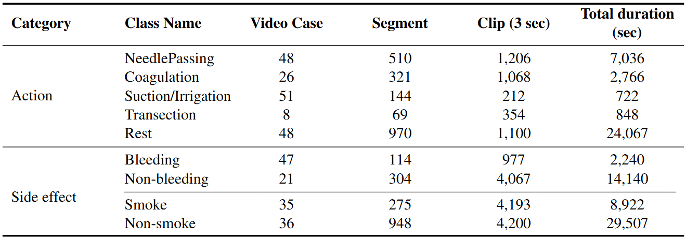
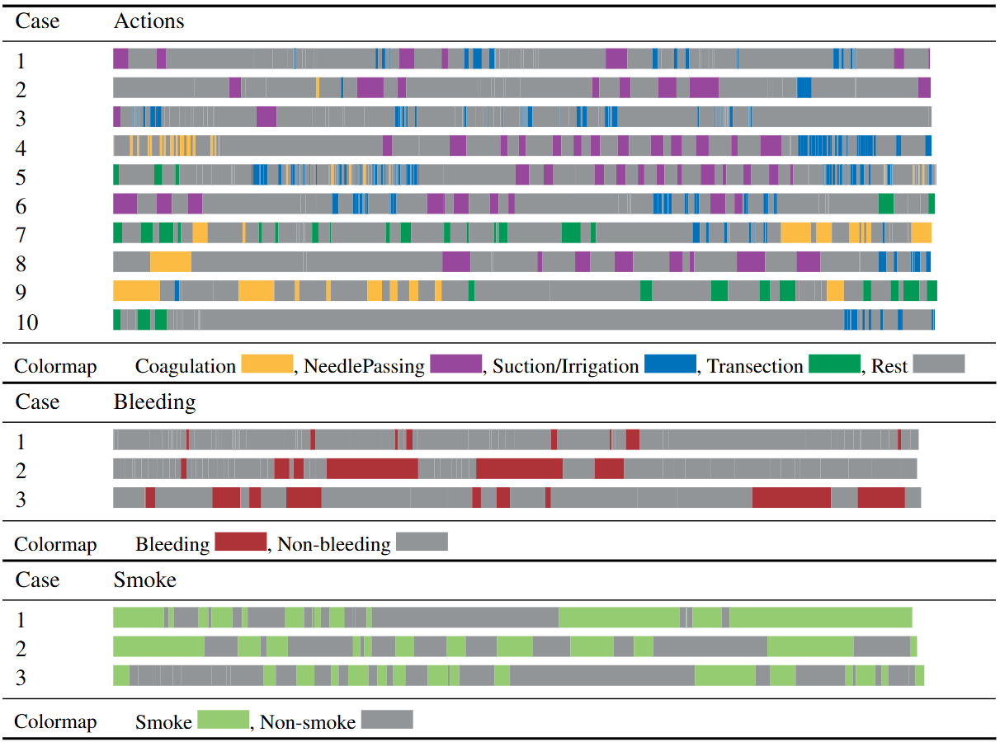
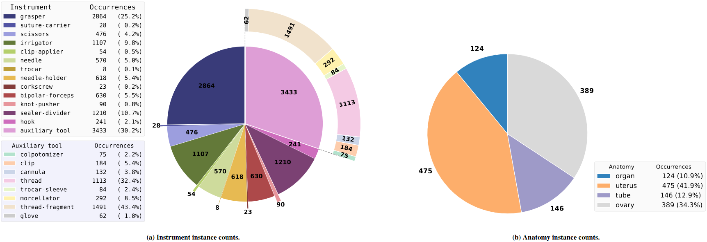
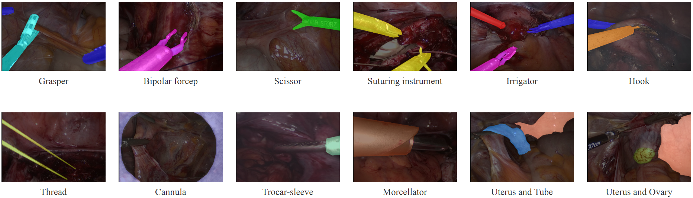

GynSurg: A Comprehensive Gynecology Laparoscopic Surgery Dataset
=============================================================================

GynSurg is a comprehensive multi-task dataset for gynecologic laparoscopic surgery, designed to support a wide range of video-based surgical analysis tasks. GynSurg integrates high-resolution video, dense temporal annotations for surgical actions and side effects, and pixel-level segmentation masks for surgical instruments and anatomical structures. This unified dataset provides a foundation for advancing research in surgical action recognition, instrument and anatomical segmentation. The structure and contents of each dataset subset are detailed in the following subsections.

Action Recognition Dataset
--------------------------
The action recognition component of GynSurg consists of 152 gynecologic laparoscopic surgery videos, selected from over 600 recorded procedures at the Medical University of Vienna and Medical University of Toronto. All videos were captured at 30 frames per second (fps) with a resolution of 1920*1080 pixels. Each video was meticulously annotated by clinical experts for four key operative actions: coagulation, needle passing, suction/irrigation, and transection. Additionally, a dedicated subset of the data was annotated for two intraoperative side effects: bleeding and smoke, supporting research on complex action and event recognition in laparoscopic surgery. **Table 1** summarizes the dataset composition across procedural actions and side effect labels. In addition to the primary laparoscopic actions, a “Rest” category is defined to represent intervals with no instrument activity or irrelevant motion. Side effects are annotated as binary classification tasks (bleeding vs. non-bleeding, smoke vs. non-smoke). The “Segments” column reports the number of extracted video segments per class, while the “Total Duration” column gives the cumulative length of all segments. To standardize the data for model development, video segments are further parti-
tioned into three-second clips (with a one-second overlap), with the resulting clip counts also reported. **Figure 1** presents example frames illustrating each surgical action and side effect.

**Table 1.** Overview of dataset composition across procedural actions and side-effect categories.

**Figure 1.** Timeline visualization of action and side-effect annotations in selected laparoscopic video cases.

Semantic segmentation dataset
-----------------------------
The semantic segmentation component of GynSurg comprises 15 laparoscopic hysterectomy videos obtained from the Medical University of Toronto. Of these, ten videos were annotated for surgical instruments and five for anatomical structures. All annotations were performed by clinical experts following standardized guidelines to ensure high-quality, pixel-level precision.

Instrument Segmentation:
The instrument segmentation dataset includes 10 annotated videos, totaling 11,352 frames at a resolution of 750*480 pixels. A total of 21 distinct instrument classes were labeled. **Figure 2** (left) shows the distribution of instrument annotations per frame. Multiple instruments often appear within the same frame, with graspers being the most frequently duplicated. 
**Figure 2.** Statistics of instrument (left) and anatomical structures (right) instances in the laparoscopy dataset.

For analysis, the instruments are categorized into two functional groups:

Primary Surgical Instruments (13 classes): Devices directly involved in tissue manipulation, cutting, coagulation, and suturing, including grasper, suture carrier, scissor, irrigator, clip applier, needle, trocar, needle holder, corkscrew, bipolar forcep, knot pusher, sealer-divider, and hook.
Auxiliary Tools (8 classes): Supportive devices and materials such as colpotomizer, clip, cannula, thread, trocar sleeve, morcellator, thread fragment, and glove.
Representative annotated frames illustrating both instrument and anatomy segmentation overlays are shown in **Figure 3**.

**Figure 3.** Visualization of pixel-level annotations for surgical instruments and anatomical structures in the GynSurg dataset.

Anatomy segmentation:
The anatomical segmentation dataset comprises five laparoscopic hysterectomy videos, yielding 1,010 labeled frames at a resolution of 750*480 pixels. Four anatomical structures were annotated: "uterus", "ovary", "fallopian tube", and a general "organ" category. For quantitative evaluation, only the uterus, ovary, and tube classes are retained due to their frequent occurrence and clinical significance. **Figure 2** (right) displays the per-frame distribution of anatomical labels, with sample annotated images presented in the rightmost panels of **Figure 3**.